# 使用不同的窗体样式

本章节介绍如何使用 WinFormedge 提供的不同窗体样式来创建具有特定外观和行为的窗口。

要使用不同的窗体样式，您需要创建一个继承自 `Formedge` 的窗体类，并重载 `ConfigureWindowSettings` 方法。在该方法中，您可以调用 `HostWindowBuilder` 提供的各种预定义窗口样式方法，如 `UseDefaultWindow` 和 `UseKioskWindow`，以获取相应的窗口设置对象。然后，您可以根据需要对这些设置进行自定义。

## 默认窗体样式

`HostWindowBuilder.UseDefaultWindow` 方法提供了最基本的 WinFormedge 窗体样式。您可以使用返回的 `DefaultWindowSettings` 对象进一步自定义此样式。

以下是一个示例，展示如何使用默认窗体样式创建一个简单的 WinFormedge 窗体：

```csharp
using WinFormedge;
namespace MyApp;
internal class MyCustomForm : Formedge
{
  public MyCustomForm()
  {
    Url = "https://www.bing.com";
  }

  protected override WindowSettings ConfigureWindowSettings(HostWindowBuilder opts)
  {
    // opts 提供了几种预定义的窗体样式方法；选择其中一种
    // 该方法返回该样式的默认设置，您可以对其进行修改
    var windowSettings = opts.UseDefaultWindow();

    // 您还可以在此处（或在构造函数中）自定义标准窗体属性，例如：
    MinimumSize = new Size(1024, 640);
    Size = new Size(1280, 800);

    // 返回自定义的窗体设置
    return windowSettings;
  }
}
```

使用以上代码，您可以创建一个具有默认窗体样式的 WinFormedge 窗体，这个窗体将具有标准的标题栏、边框和系统菜单。

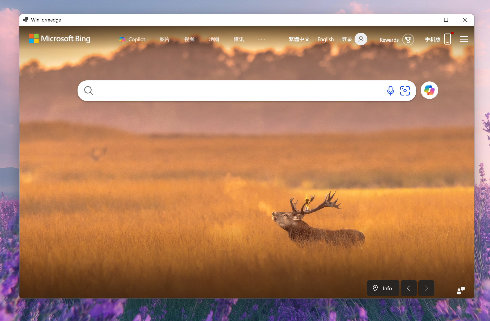

## 将内容扩展到标题栏区域

继续使用 `HostWindowBuilder.UseDefaultWindow` 方法提供了最基本的 WinFormedge 窗体样式，您可以通过设置 `ExtendsContentIntoTitleBar` 属性，将内容扩展到标题栏区域，从而实现无边框窗体效果。

此时，您可以使用 HTML/CSS 来设计标题栏区域的内容和样式，自行设计关闭、最小化和最大化按钮的样式，并灵活控制这些按钮的行为。WinFormedge 同时提供了一系列界面交互的 API 方便您实现这些功能。这部分 API 有些是基于 html 和 css 属性实现的，有些是基于 WinFormedge 提供的 JavaScript 接口实现的，您可以参考[窗体交互 API 文档](./window-interaction-apis.zh-CN.md)了解更多细节。

下面是一个示例，展示如何创建一个将内容扩展到标题栏区域的无边框 WinFormedge 窗体：

```csharp
using WinFormedge;
namespace MyApp;
internal class MyBorderlessForm : Formedge
{
  protected override WindowSettings ConfigureWindowSettings(HostWindowBuilder opts)
  {
    var windowSettings = opts.UseDefaultWindow();

    // 将内容扩展到标题栏区域
    windowSettings.ExtendsContentIntoTitleBar = true;

    // 您还可以在此处（或在构造函数中）自定义标准窗体属性，例如：
    MinimumSize = new Size(1024, 640);
    Size = new Size(1280, 800);

    // 返回自定义的窗体设置
    return windowSettings;
  }
}
```

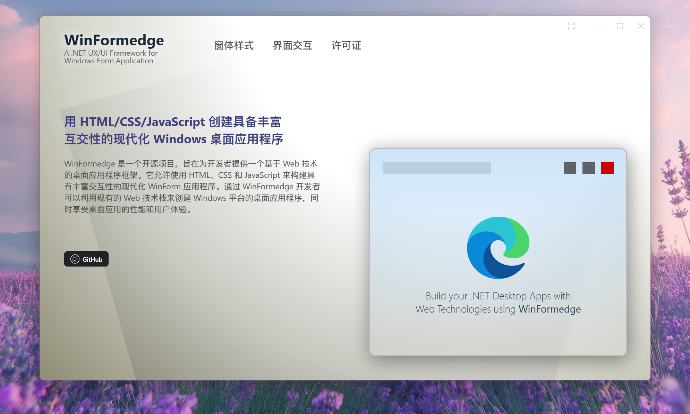

## 窗体背景效果

`HostWindowBuilder.UseDefaultWindow` 方法返回的 `DefaultWindowSettings` 对象包含一个名为 `SystemBackdropType` 的属性，您可以使用该属性来设置窗体的背景效果。WinFormedge 支持多种背景效果，包括模糊、亚克力和 Windows 11 的 Mica 效果。 您可以根据需要选择合适的背景效果，以提升应用程序的视觉体验。

### 默认背景效果

使用 `SystemBackdropType.Auto` 可以让窗体采用系统默认的背景效果。这通常会根据操作系统的设置自动调整背景效果。

```csharp
windowSettings.SystemBackdropType = SystemBackdropType.Auto;
```

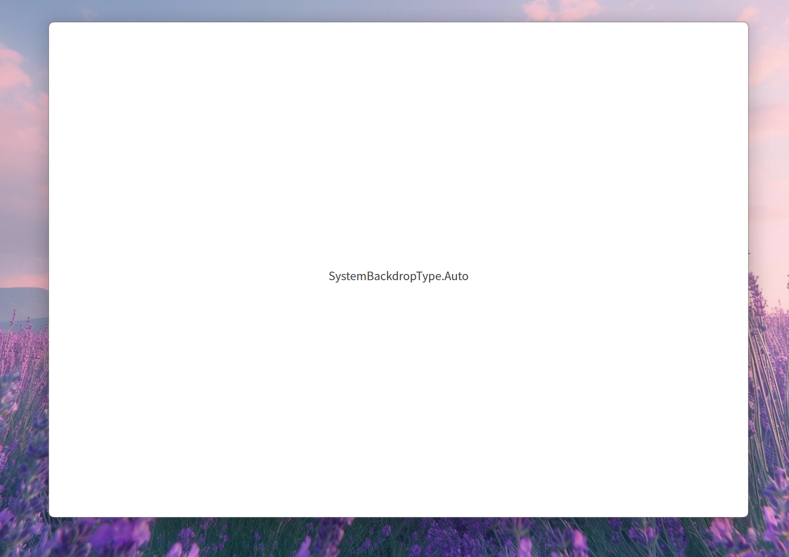

### 无背景效果

使用 `SystemBackdropType.None` 可以创建一个没有背景效果的窗体，使其完全透明。您可以使用 HTML/CSS 来设计窗体的外观和样式。

```csharp
windowSettings.SystemBackdropType = SystemBackdropType.None;
```

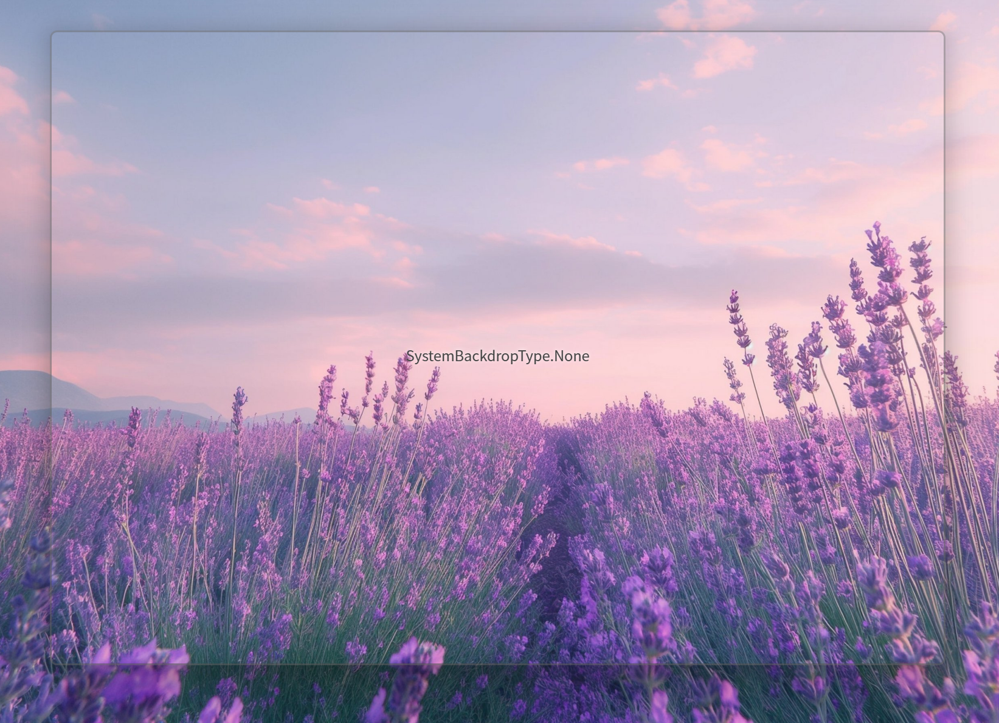

### 模糊背景效果

使用 `SystemBackdropType.BlurBehind` 可以为窗体应用模糊背景效果，类似于玻璃效果。这种效果可以提升窗体的视觉层次感。

```csharp
windowSettings.SystemBackdropType = SystemBackdropType.BlurBehind;
```

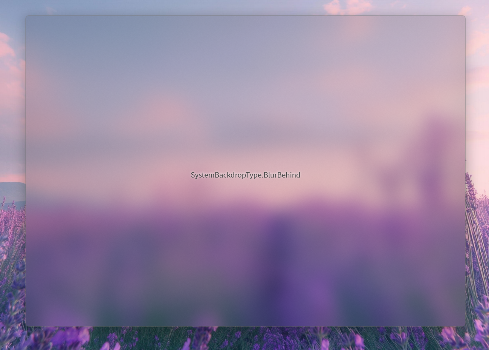

### 亚克力背景效果

使用 `SystemBackdropType.Acrylic` 可以为窗体应用亚克力背景效果。这种效果在 Windows 10 及更高版本中可用，能够提供一种半透明模糊的视觉效果。与 `BlurBehind` 效果相比，您可以使用 `BackColor` 属性来调整亚克力效果的颜色和透明度。

```csharp
windowSettings.SystemBackdropType = SystemBackdropType.Acrylic;
```

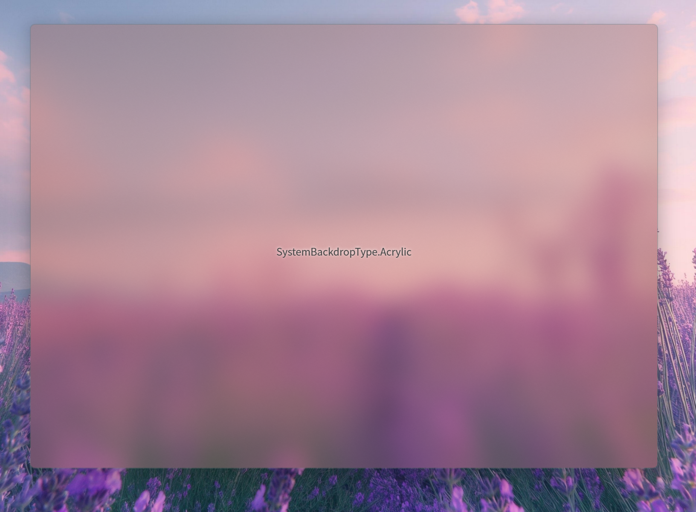

### Mica 背景效果

使用 `SystemBackdropType.Mica` 可以为窗体应用 Windows 11 的 Mica 背景效果。这种效果能够根据桌面壁纸的颜色动态调整窗体的背景色。

```csharp
windowSettings.SystemBackdropType = SystemBackdropType.Mica;
```

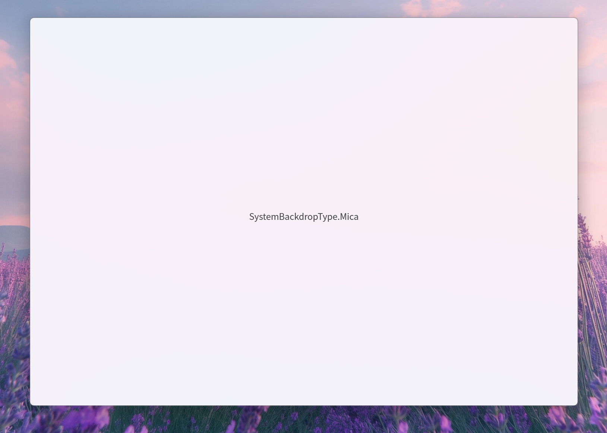

### Mica Alt 背景效果

使用 `SystemBackdropType.MicaAlt` 可以为窗体应用 Windows 11 的 Mica Alt 背景效果。这种效果与 Mica 效果类似，但具有不同的视觉风格。

```csharp
windowSettings.SystemBackdropType = SystemBackdropType.MicaAlt;
```

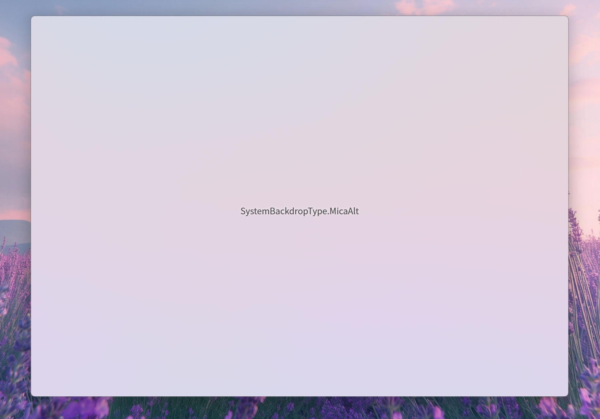

### Transient 背景效果

使用 `SystemBackdropType.Transient` 可以为窗体应用 Windows 11 的 transient 模糊背景效果。这种效果提供了一种轻量级的模糊视觉体验。

```csharp
windowSettings.SystemBackdropType = SystemBackdropType.Transient;
```

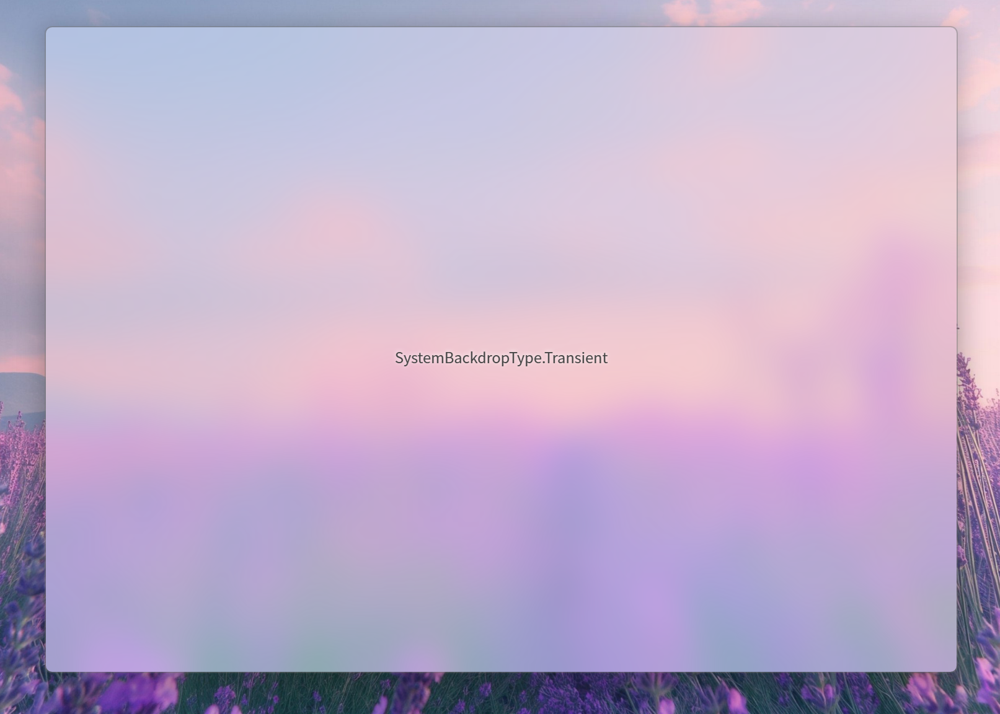

## 透明窗体与自定义边框

通过将 `SystemBackdropType` 设置为 `None` 并将 `ShowWindowDecorators` 设置为 `false`，您可以创建一个完全透明的窗体。此时，您可以使用 HTML/CSS 来设计窗体的外观和样式，包括边框、阴影等细节。您需要使用 `WindowEdgeOffsets` 属性来手动指定窗体边缘的偏移量，以调整内容与边框之间的间距。

WinFormedge 源码附带的示例程序 `MinimalExampleApp` 中有一个透明窗体的示例，该窗体的所有细节均由 HTML/CSS 实现，运行后您将看下图所示的窗体效果：

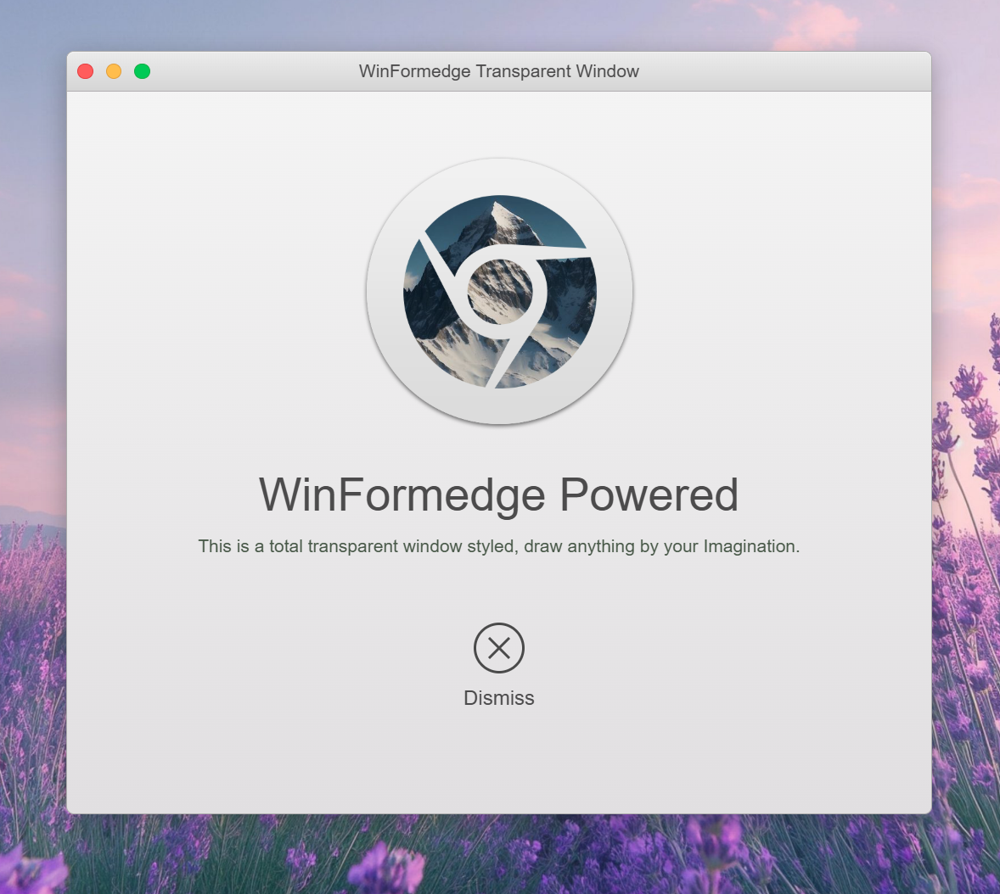

该窗体的边框使用了以下 CSS 代码来实现阴影效果：

```css
box-shadow: 0px 5px 20px #333333;
```

根据测量，您需要阴影部分排除到 WinFormedge 的鼠标 HitTest 处理范围之外，因此需要将 `WindowEdgeOffsets` 设置为 `new Padding(20, 15, 20, 25)` 以确保阴影效果完整显示，并将阴影部分裁剪后计算出实际窗体边缘的偏移量，这样 WinFormedge 才能正确处理鼠标事件。

```csharp
windowSettings.SystemBackdropType = SystemBackdropType.None;
windowSettings.ShowWindowDecorators = false;
windowSettings.WindowEdgeOffsets = new Padding(20, 15, 20, 25); // 设置边缘偏移量
```

关于如何精确获取到阴影部分的尺寸，您可以在浏览器的开发者工具中使用元素检查功能来测量阴影的正确大小。如图所示，使用开发者工具并选中窗体边框元素后，可以根据不同色块以精确获取到阴影的尺寸，您可以对其截图并使用其他图像处理工具来测量阴影的大小。

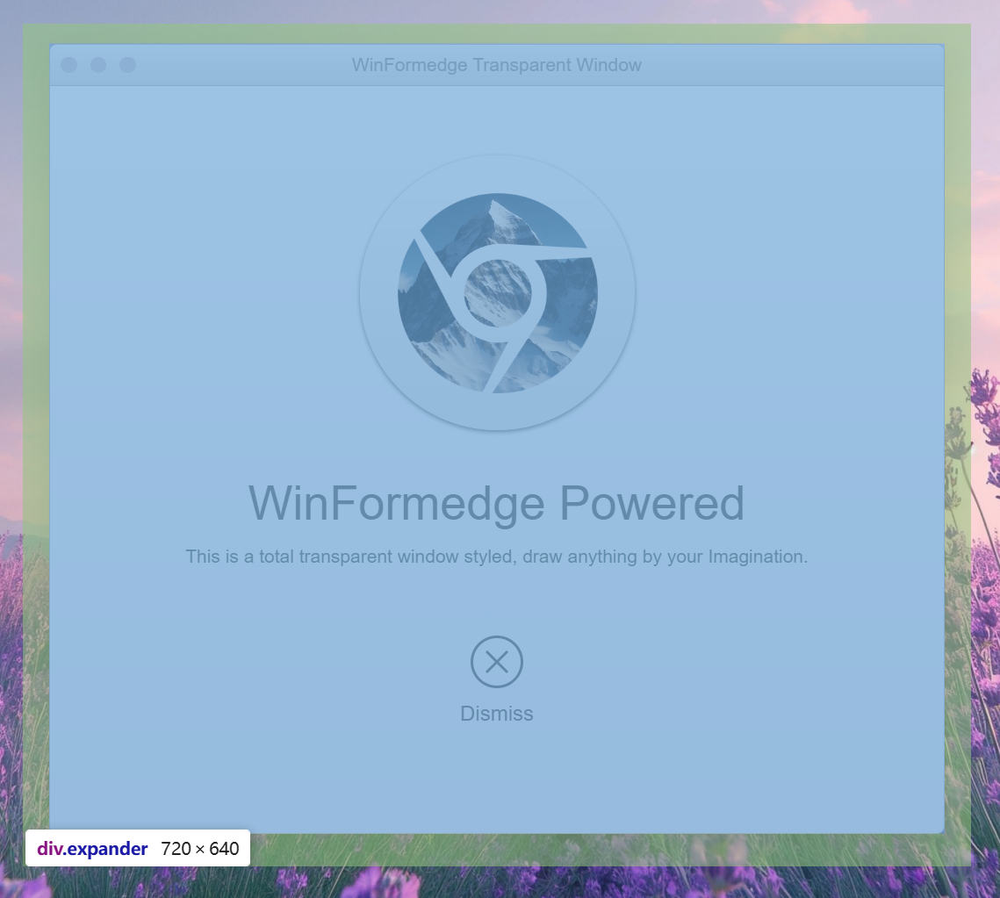

## 参考

- [窗体样式](./window-styles.zh-CN.md)
- [窗体交互 API](./window-interaction-apis.zh-CN.md)
